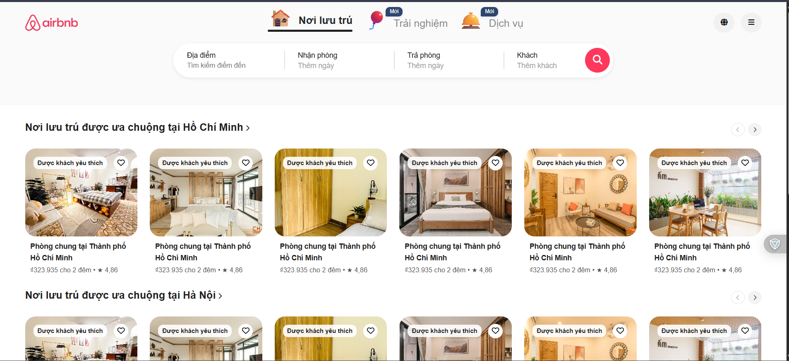
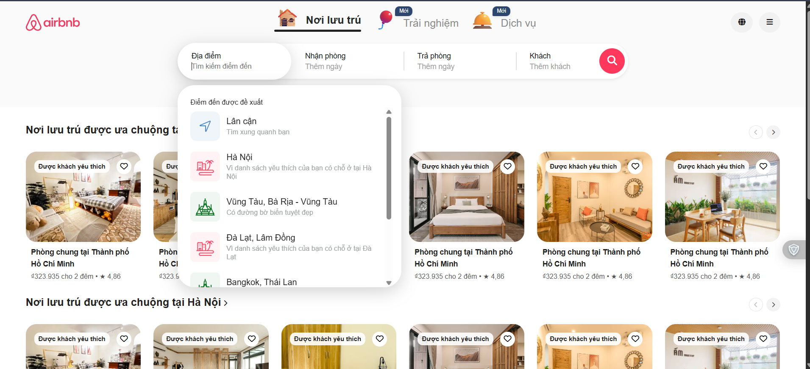
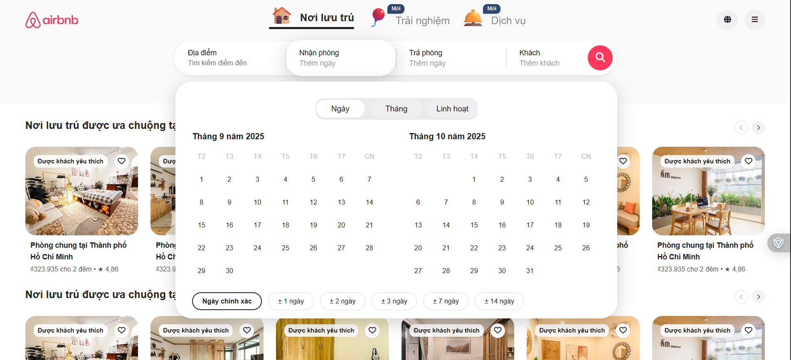

# Airbnb Clone – UI Project

A personal frontend UI clone project that focuses on recreating the Airbnb homepage layout using pure HTML and CSS.

## 🖼️ Demo Preview

### Homepage

### Header & Search

### Footer

> All screenshots are taken from this project’s implementation, not from the original Airbnb website.

---

## 🎯 Project Description

This is a **personal UI clone project** created to practice **HTML and CSS fundamentals** by recreating the layout and visual structure of the Airbnb homepage.

The project focuses purely on **UI and layout implementation**, without backend or complex JavaScript logic.

## 🚀 Features

- **Header Navigation**  
  Navigation bar with main menu items styled similar to Airbnb

- **Search Bar (UI Only)**  
  Search interface with location input and dropdown-style layout (visual implementation)

- **Product Listings (UI)**  
  Room listings layout with images and basic information

- **Footer Section**  
  Footer layout with links and informational sections

## 🛠️ Technologies Used

- HTML5  
- CSS3  
  - Flexbox  
  - Grid System  
- Font Awesome Icons  

## 💡 Highlights

- UI closely follows the Airbnb homepage layout
- Custom grid system for responsive layout
- CSS variables for color and spacing management
- Hover effects and smooth transitions
- Clean and organized CSS structure

## 📌 Scope & Notes

- Static website (UI only)
- No backend, no database
- No deployment
- Created 100% as an individual learning project

## 📄 License

This project is created for **learning and portfolio purposes only**.
